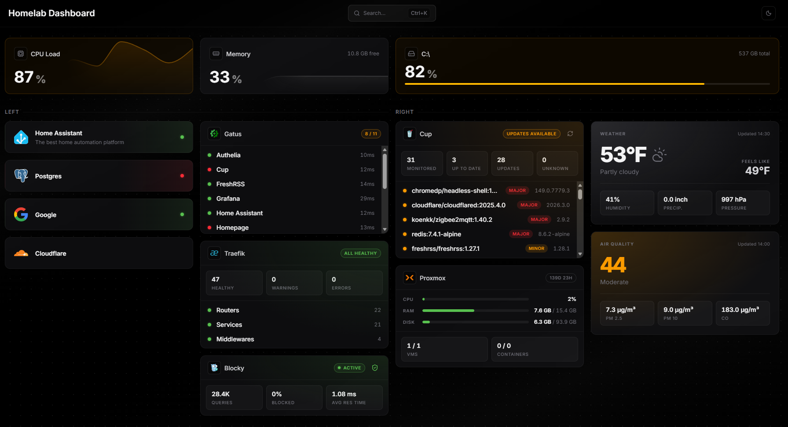

# CyberDashboard

A modern, configurable homelab dashboard built with TanStack Start (SSR), React 19, TypeScript, Bun, Vite+, and Vanilla Extract.

It renders widgets for system metrics, weather, service health, and infrastructure tools (like Gatus, Traefik, Proxmox, Blocky, and more), all driven by a single config file.



## Features

- ⚡ SSR app powered by TanStack Start + React 19
- 🧩 Config-driven widget layout (`config.jsonc` / `config.yaml` / env overrides)
- 🩺 Pluggable status providers (`docker`, `gatus`, `ping`)
- 🔁 Server-streamed live updates for dynamic widgets
- 🎨 Zero-runtime CSS with Vanilla Extract
- 🔐 Built-in auth environment support + optional OAuth2 config

## Quick Start

1. Install dependencies:

    `bun install`

2. Configure dashboard widgets in one of:
    - `config.jsonc` (recommended)
    - `config.json`
    - `config.yaml`
    - `config.yml`

    Config sources are merged, and `CONFIG_` environment variables can override config values.

3. Run the app:

    `bun run dev`

4. Open: `http://localhost:3000`

## Configuration

Main config schema is defined in `src/lib/config/schema.ts`.

### Minimal `config.jsonc` example

```jsonc
{
	"$schema": "./config.schema.json",
	"title": "My Dashboard",
	"baseUrl": "http://localhost:3000",
	"units": "metric",
	"widgets": [
		{ "type": "cpu-load", "refreshInterval": 5000, "showGraph": true },
		{ "type": "memory-used", "refreshInterval": 5000, "showGraph": true },
		{ "type": "storage-used", "drive": "/" },
		{
			"type": "service-link",
			"name": "Traefik",
			"url": "http://localhost:8080",
			"status": { "provider": "infra", "service": "traefik" },
		},
	],
	"statusProviders": {
		"infra": {
			"type": "ping",
			"refreshInterval": 5000,
			"timeout": 5000,
			"services": {
				"traefik": "192.168.1.10",
			},
		},
	},
}
```

## Supported Widget Types

- `cpu-load`
- `memory-used`
- `storage-used`
- `service-link`
- `open-meteo-weather`
- `open-meteo-air-quality`
- `gatus`
- `traefik`
- `cup`
- `proxmox`
- `blocky`

Widget schemas live in `src/widgets/*/schema.ts`.

## Supported Status Providers

- `docker`
- `gatus`
- `ping`

Provider schemas live in `src/services/status/*/schema.ts`.

## Development Notes

- After changing `src/lib/config/schema.ts`, run:

    `bun run generate:schema`

## Validation

Recommended pre-PR checks:

- `bun run typecheck`
- `bun run lint`
- `bun run format:check`
